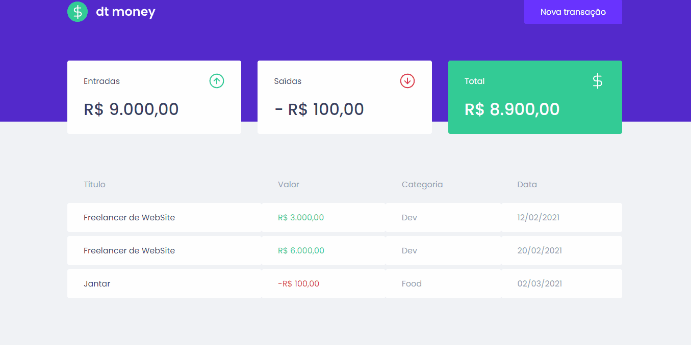
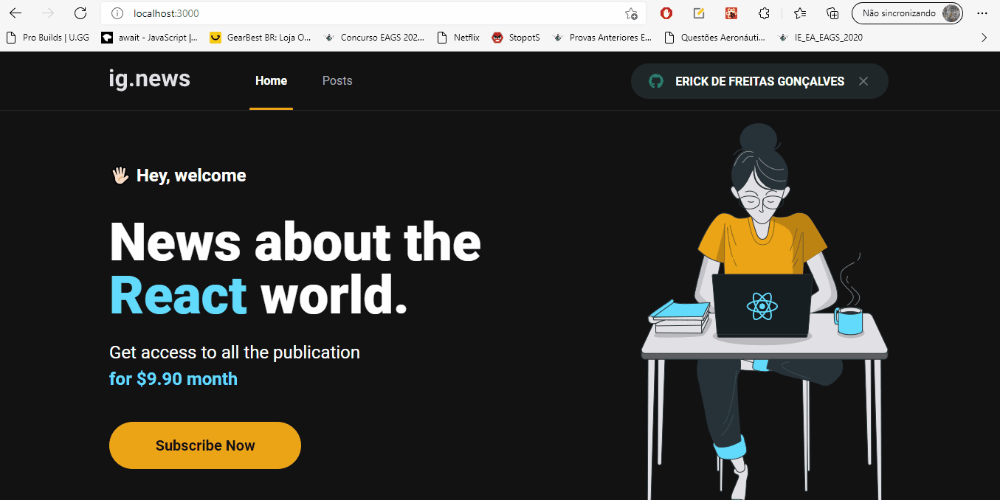
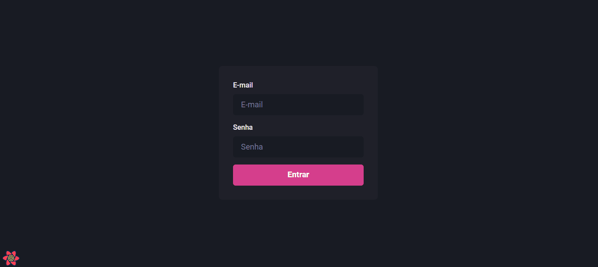
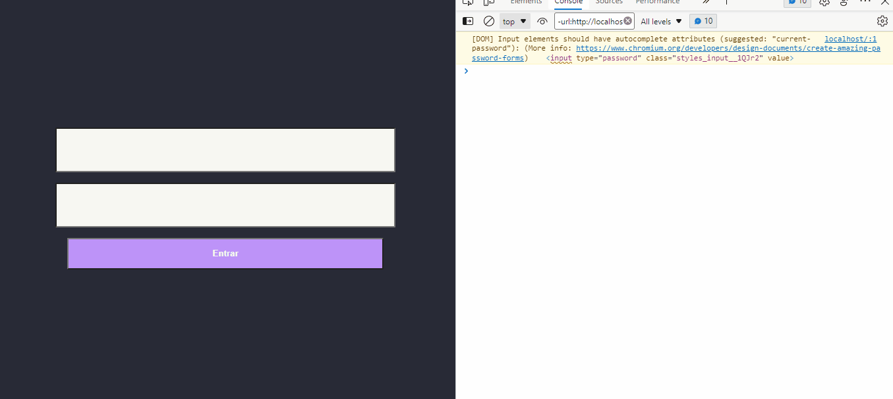
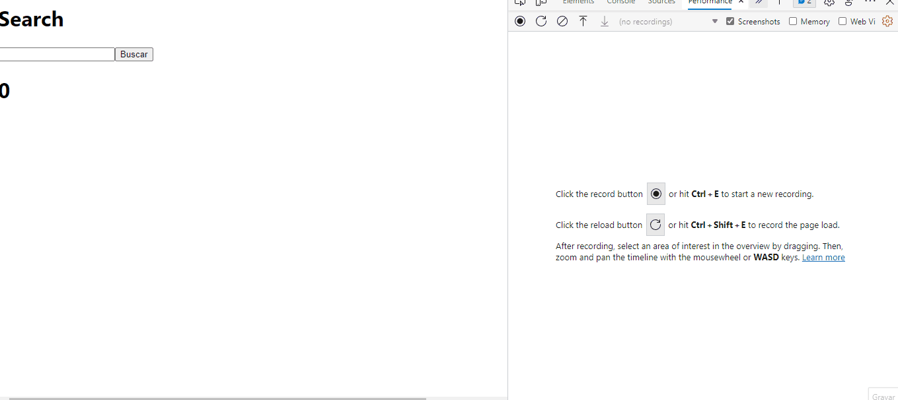

 <br/>
 <br/>

 #  Ignite ReactJS ✨
<br/>
<br/>
 
 ##   DTMONEY ✅

 <br/>
 
 ```
 App de gerenciamento financeiro.
 ```
<br/>
<br/>

### Demonstração da aplicação 🎥 

<br/>
<br/>

<h1 align="center">
  
</h1>

<a href="https://github.com/NinjaAzul/dt-money"> Code Here !</a>


##  Tecnologias utilizadas ✅

### 🛠 Tecnologias

As seguintes ferramentas foram usadas na construção do projeto:

- [ReactJS](https://reactjs.org/docs/getting-started.html)
- [ReactModal](https://reactcommunity.org/react-modal/)
- [StyledComponents](https://styled-components.com/)
- [HTML](https://devdocs.io/html/)
- [JavasCript](https://developer.mozilla.org/pt-BR/docs/Web/JavaScript)
- [TypesCript](https://www.typescriptlang.org/#:~:text=TypeScript%20is%20an%20open-source%20language%20which%20builds%20on,to%20validate%20that%20your%20code%20is%20working%20correctly.)


<br/>
<br/>
 
 ##   IGNews ✅

 <br/>
 
 ```
 App de stremer de conteudo no tipo texto: 
 ```

 - [x] Assinatura mensais.
 - [x] Cadastro de Usúarios.
 - [x] Plataforma de gerenciamento do conteúdo.
 - [x] SSG / SSR / API Routes

<br/>

### Demonstração da aplicação 🎥 

<br/>
<br/>

<h1 align="center">
  
</h1>

<h1 align="center">
  
</h1>

<a href="https://github.com/NinjaAzul/ignews"> Code Here !</a>


##  Tecnologias utilizadas ✅

### 🛠 Tecnologias

As seguintes ferramentas foram usadas na construção do projeto:

- [NextJs](https://nextjs.org/docs/getting-started)
- [StripeJS](https://stripe.com/docs/payments/elements)
- [FaunaDB](https://docs.fauna.com/fauna/current/)
- [Next-Auth](https://next-auth.js.org/getting-started/example)
- [Axios](https://axios-http.com/)
- [Jest](https://jestjs.io/docs/getting-started)
- [Prismic-CMS](https://prismic.io/docs)
- [SCSS](https://sass-lang.com/documentation)
- [HTML](https://devdocs.io/html/)
- [JavasCript](https://developer.mozilla.org/pt-BR/docs/Web/JavaScript)
- [TypesCript](https://www.typescriptlang.org/#:~:text=TypeScript%20is%20an%20open-source%20language%20which%20builds%20on,to%20validate%20that%20your%20code%20is%20working%20correctly.)

<br/>
<br/>
 
 ##   DashGo ✅

 <br/>
 
 ```
  Applicativo de gerenciamento de usúarios.
 ```
<br/>
<br/>

### Demonstração da aplicação 🎥 

<br/>
<br/>

<h1 align="center">
  
</h1>

<a href="https://github.com/NinjaAzul/dashgo"> Code Here !</a>


##  Tecnologias utilizadas ✅

### 🛠 Tecnologias

As seguintes ferramentas foram usadas na construção do projeto:

- [NextJs](https://nextjs.org/docs/getting-started)
- [Chakra-UI](https://chakra-ui.com/docs/getting-started)
- [Apexcharts](https://apexcharts.com/docs/installation/)
- [Framer-Motion](https://www.framer.com/developers/)
- [React-Icons](https://react-icons.github.io/react-icons/)
- [React-Query](https://react-query-v2.tanstack.com/)
- [HTML](https://devdocs.io/html/)
- [MirageJS](https://miragejs.com/api/classes/association/)
- [JavasCript](https://developer.mozilla.org/pt-BR/docs/Web/JavaScript)
- [TypesCript](https://www.typescriptlang.org/#:~:text=TypeScript%20is%20an%20open-source%20language%20which%20builds%20on,to%20validate%20that%20your%20code%20is%20working%20correctly.)

<br/>
<br/>
 
 ##   AuthApp ✅

 <br/>
 
 ```
 Autenticação de aplicações convencionais com JWT.
 ```
<br/>
<br/>

### Demonstração da aplicação 🎥 

<br/>
<br/>

<h1 align="center">
  
</h1>

<a href="https://github.com/NinjaAzul/ignite-auth"> Code Here !</a>


##  Tecnologias utilizadas ✅

### 🛠 Tecnologias

As seguintes ferramentas foram usadas na construção do projeto:

- [NextJS](https://reactjs.org/docs/getting-started.html)
- [Jwt-Decode](https://www.npmjs.com/package/jwt-decode)
- [Cookies](https://developer.mozilla.org/en-US/docs/web/api/document/cookie)
- [CSS](https://devdocs.io/css/)
- [HTML](https://devdocs.io/html/)
- [JavasCript](https://developer.mozilla.org/pt-BR/docs/Web/JavaScript)
- [TypesCript](https://www.typescriptlang.org/#:~:text=TypeScript%20is%20an%20open-source%20language%20which%20builds%20on,to%20validate%20that%20your%20code%20is%20working%20correctly.)

<br/>
<br/>
 
 ##   PerfomApp ✅

 <br/>
 
 ```
 Utilizando methodos para otimizar a aplicação.
 ```
<br/>
<br/>

### Demonstração da aplicação 🎥 

<br/>
<br/>

<h1 align="center">
  
</h1>

<a href="https://github.com/NinjaAzul/perform-app-ignite"> Code Here !</a>


##  Tecnologias utilizadas ✅

### 🛠 Tecnologias

As seguintes ferramentas foram usadas na construção do projeto:

- [NextJS](https://reactjs.org/docs/getting-started.html)
- [json-server](https://www.npmjs.com/package/jsonserver)
- [CSS](https://devdocs.io/css/)
- [HTML](https://devdocs.io/html/)
- [JavasCript](https://developer.mozilla.org/pt-BR/docs/Web/JavaScript)
- [TypesCript](https://www.typescriptlang.org/#:~:text=TypeScript%20is%20an%20open-source%20language%20which%20builds%20on,to%20validate%20that%20your%20code%20is%20working%20correctly.)
